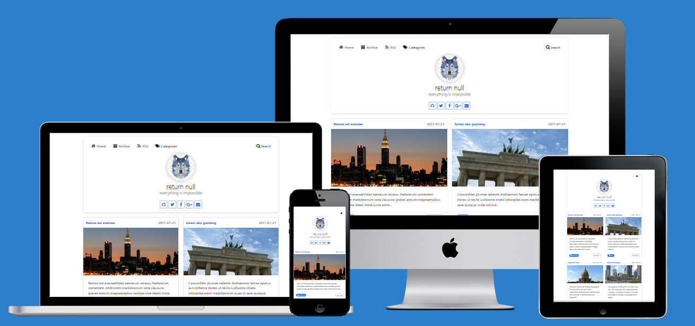

# Goyangin Theme Hexo
Live Demo : [Goyangin Theme](http://goyangin.g3xx.com/). <br />
Demo Post : [All Tags](http://goyangin.g3xx.com/2017/07/tag-all-in-post/). <br />
This Theme no need category post, just use Tag in post for category. <br />



# Feature
 - Responsive 
 - Fast
 - Google Analytics
 - Disqus Comment
# Installation
clone theme

    git clone https://github.com/devgexx/goyangin.git themes/goyangin
    
modify file `_config.yml` site

    theme: goyangin

And, Modify Config Theme in `/themes/goyangin/_config.yml`
```sh
# Header link with icon font awesome (fa-icon : link)
# name auto font awesome
menu:
  Home: /
  Archive: /archives
  RSS: /atom.xml
  
grid: 2 # change index columns /line
logo: img/logo.jpg #logo in header
gravatar: yourmail@mail.com #img gravatar in post
author: g3xx #name author in post (default)
excerpt_link: Read More #chnge text in read more in index
thumbimg : http://lorempixel.com/640/320/city/ # default img (thumbail post) if post no image

## more need change
disqus_shortname: goyangin # goyangin.disqus.com
google_analytics:         # UA-83xxxx1-2

# if u want add more profile media social (icon same as Fontawesome)
#  just add name ex : Instagram: https://www.instagram.com/you/
social:
  Github: https://github.com/you
  Twitter: https://twitter.com/you
  Facebook: https://facebook.com/you
  Google-plus: https://plus.google.com/104751165505597913805
  email: yourmail@mail.com
  #Instagram: https://www.instagram.com/you/

# Code Highlight theme
# Available value:
#    default | normal | night | night eighties | night blue | night bright
# https://github.com/chriskempson/tomorrow-theme
highlight_theme: night eighties
```
# Getting Started with Post
1. Create Post.`$ hexo new Post "inyong lop ded indonesia"`
2. Edit File in `sorce\_post\inyong lop ded indonesia`
3. **TAGS is CATEGORY** (No Need add Category)
```
---
title: Hello World
date: 2017-07-18 15:43:12
thumbs: image/path/want/thunb
tags: 
    - markdown 
    - Github
    - indonesia
---
you post in here ..
```
# Version Logs
- This maybe Beta Version 
- Later i will Feature share with Icon in Post and
- add meta tag (facebook, gplus, twitter, etc)
# Copyright
(c) 2017 by g3xx (partai YCL), 100% :heart: **INDONESIA**
# License
**MIT**
